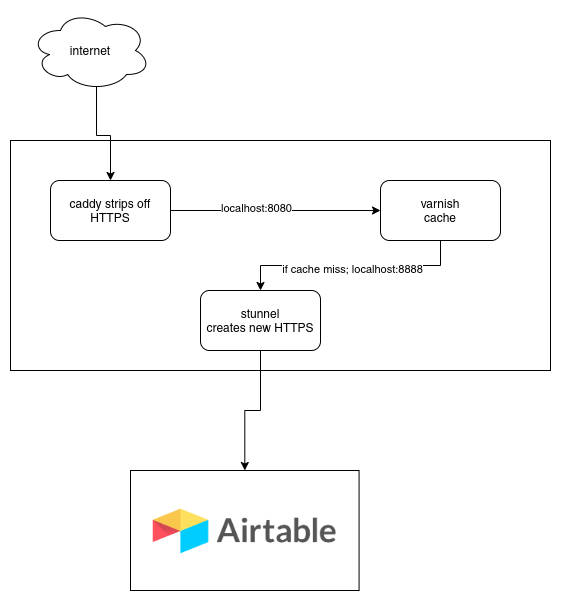

---
---

# VacFind AirTable Caching API

## What is it?

AirTable's API limits the requests 5 requests per second per base and suggests using a caching server to get anything more than this.

We have set up a low-cost GCP f1-micro instance to act as this caching server so our site can handle bursts of traffic that exceed 5 requets a second without being locked out for 30 seconds by airtable.

## Compatability
All AirTable libraries that allow you to change the endpoint URL should work with our caching endpoint

## Endpoint
The api can be accessed publicly https://api.vacfind.org

## API Keys 

At present our caching server requires no additional authentication as it just forwards and caches requests to airtable's API. if you have an airtable base ID and API key, you are good to go.

### Protecting your keys
If you plan to use your keys from the client-side (such as with javascript) then it is IMPOSSIBLE to keep this key 100% private as it will need to be sent to the server to retrieve your data and will be visible in inspect element.

Here are some general-purpose ideas for ways to mitigate this:
- Airtable has a [support page](https://support.airtable.com/hc/en-us/articles/360056249614-Creating-a-read-only-API-key) documenting how to create a read-only API key
- Set up your API to only allow requests from your domain. This way your API keys are useless unless an attacker also controls your domain name. If you are using the VacFind Cache, [contact us](#contact) and we can work with you to set this up.
- Generate your site's pages server-side. This way, your server can keep the API key private and embed only the results of the requests in pages that get sent to clients. This is one of the more secure ways to do it and allows other potential benefits such as caching responses for much faster page loads.

## Limits

There isnt anything special about our caching server that limits it to being used for just our own airtable bases or API keys, While untested, its entirely possible for anyone to use their own base ID and APIkeys to read their Airtable bases and have the results cached for much faster delivery.

Currently the caching server is not explicitly set up to support writing data to your airtable databases, however, it *should* work. If you need this and run into issues that require configuration on our side, please [contact us](#contact).

This API was initially set up for our own use at VacFind so it wasnt configured with much redundancy or loadbalancing in mind. That said, the [capability exists](#caddy) so if higher availability is something you need, [contact us](#contact).

We are just some students with a little free time trying to help as much as we can. We are unale to be available 24/7 to respond to issues or

## Server Architecture

### Caddy
The caching server uses [Caddy](https://caddyserver.com/) to provide super easy HTTPS. Caddy also has the capability to provide load balancing should

### Varnish
By some measures, Varnish is one of the fastest caching servers there is. It is also able to [serve older content from the cache in case your actual API goes down](https://varnish-cache.org/docs/6.5/users-guide/vcl-grace.html#misbehaving-servers) as opposed to showing no data or an error. While our caching is not currently set up for this, we plan to set this up soon.

### stunnel
Because [varnish doesnt support HTTPS](https://varnish-cache.org/docs/trunk/phk/ssl_again.html), we use stunnel as a HTTPS client to create secure requests out to Airtable's API when varnish needs to fetch records direct from airtable. 

## Monitoring

The API has some basic monitoring set up to alert us if there is downtime.

## Hosting Costs

While we will do our best to host this for free/out-of-pocket, we ask that projects that have available funds, especially those that heavily use our cache, contribute what you can to help us provide this caching ability for smaller projects that arent able to afford it.

Donations can be made through our [OpenCollective Page]({{site.social.opencollective}}) and are tax-deductible.

## Contact

While we are just some students with a little free time trying to help as much as we can, we would love to help you make the most of our caching solution so you can focus on building and maintaining your apps. 

We prefer that you [reach out to us on discord]({{site.social.discord}}), but you can also [email us]({{site.contact.email}}) as well. 